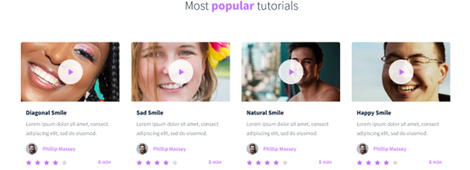
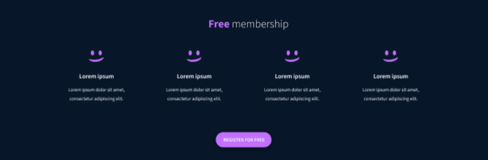
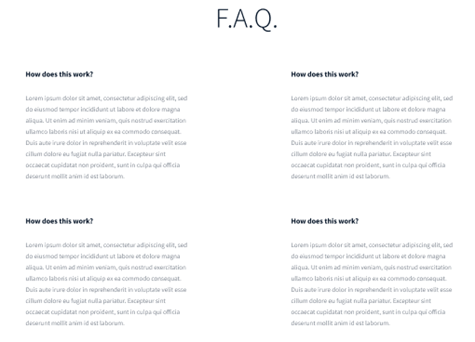

SmileSchool Website
This project is a simple landing page for SmileSchool, an educational platform that teaches people how to smile with confidence. The page highlights various features of the platform, including tutorials, free membership, FAQs, and instructor information.

Table of Contents
Overview
Features
Technologies Used
How to Run the Project
Credits
Overview
The SmileSchool landing page is designed to provide users with an overview of the platform's offerings. Users can explore tutorials, see instructor information, register for free membership, and browse frequently asked questions (FAQ).

Features
Responsive Design: The page is designed to be responsive across different screen sizes using standard HTML.
Instructors Section: Displays featured instructors with their achievements and accolades.
 
Popular Tutorials: A section showcasing the most popular tutorials, each with a 5-star rating system.
 
Free Membership: Offers users the chance to register for a free membership and explore features.
 
Frequently Asked Questions (FAQ): Provides answers to common questions about the platform.
  
Footer with Social Media Links: Includes icons for Facebook, Twitter, and Instagram using FontAwesome.
 
Technologies Used
HTML5: Used for the structure of the page.
FontAwesome: Icons for social media links and star ratings.
Images: Placeholder images are used for logos, tutorials, and instructor profiles.
How to Run the Project
Download the Repository:

Clone or download this project repository to your local machine.
Open the HTML File:

Navigate to the project folder and open the index.html file in your preferred web browser.
External Resources:

Ensure that you are connected to the internet to load FontAwesome icons (included via CDN).
Optional:

Replace placeholder images (e.g., fakeimg.pl and images in the ./images/ folder) with your own images to customize the look and feel of the page.
Credits
FontAwesome for icons (social media and star ratings).
Fakeimg.pl for sample logo images used in the navigation and footer.
